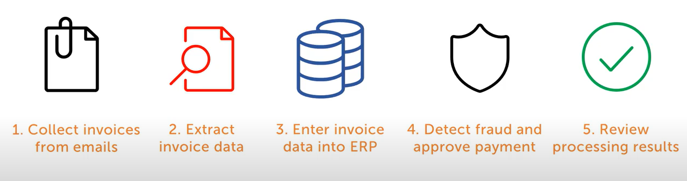
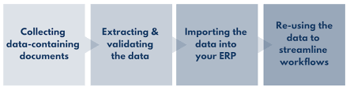
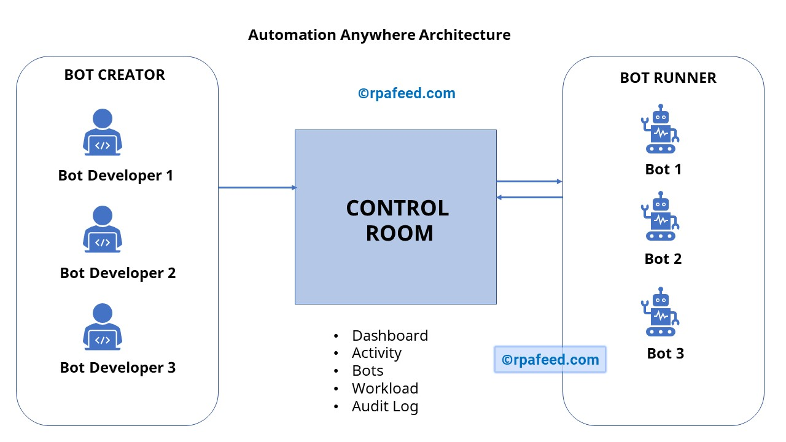
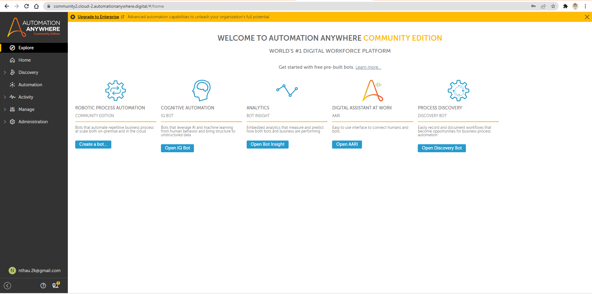
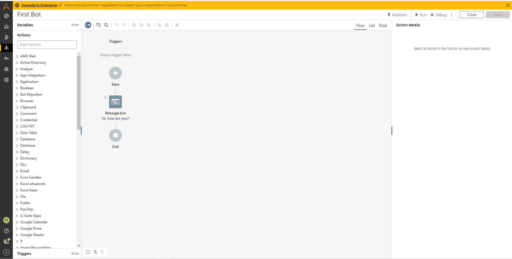
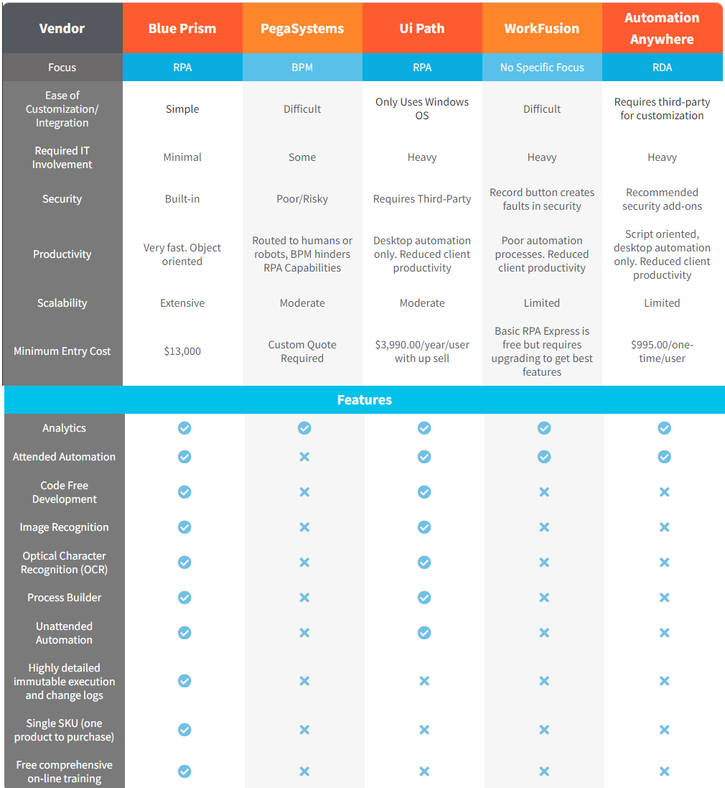

# RPA - Robotic Process Automation

## I. Types of RPA

---

- Supervised RPA = System + Human
- Unsupervised RPA = Only System
- Hybrid RPA = System + Optional Human

## II. RPA vs AI

---

- RPA = hands / legs (take robot out of human)
- AI = brain (put human into robot )

## III. Which factors should you consider while selecting a RPA Software?

---

You should consider the following factors before selecting a tool:

- Desired **Platform Support**: Web, Desktop, Citrix, SAP, etc
- **License Cost** if applicable
- In the case of an outsourcing project, you need to factor customer/Client preference of the automation tool
- The cost involved in **training employees** on the tool
- **Hardware/Software requirements** of the automation tool
- Support and Update policy of the automation tool vendor.

## IV. RPA Tools

---

1. **[UiPath](https://www.uipath.com/) - free**

   - **Features:**
     - Email automation
     - Scrap data
     - Can work with spreadsheet, workbook, pdf
     - Auto simple reCAPTCHA popup (I’m not a robot)
     - Auto download, upload files
   - **Disadvantages:**
     - Does not have image processing (ML, face recognition, etc), barcode reader.
     - Cannot work with physical form.
     - Does not support voice commands (can be useful in call centers)

2. **[ZAPTEST](https://www.zaptest.com/media-pages/robotics-process-automation?utm_campaign=ZAPTEST%20FREE&utm_source=ppc&utm_medium=guru99&utm_content=landing%20page) - free**
   - **Goal**: who is looking to automate it’s back-office operations or software testing processes and to develop a seamless and revolving automation framework.
   - **Features**:
     - Functional and Performance Test Automation
     - RPA (Robotic Process Automation)
     - Seamless Test+RPA Software Automation
     - Cross-Platform (Parallel) Execution
     - DevOps (Mock-ups) Automation
     - API Testing
     - Auto-Documentation
   - **Companies currently use Zaptest**:
     | **Website** | **Employee Range** | **City** | **Region** | **Country** |
     |:---------------------: |:------------------: |:-------------: |:-----------: |:-------------: |
     | Olenick | 201-500 | Chicago | Illinois | United States |
     | QA Consultants | 201-500 | Toronto | Ontario | Canada |
     | Inflectra | 11-50 | Silver Spring | Maryland | United States |
     | ZAP TECHNOLOGIES, INC | 1-10 | Alpharetta | Georgia | United States |
     | Software Testing Help | 11-50 | Pune | Maharashtra | India |
     | ZAPTEST | 11-50 | Atlanta | Georgia | United States |
     | CodingSight | 1-10 | Mountain View | | Kenya |
     | Automated-360 | 1-10 | | | |
     | TestGuild | 1-10 | Oakdale | Tennessee | United States |
     | FiveTeams | 1-10 | Berlin | Berlin | Germany |
3. **[Eggplant](https://info.eggplantsoftware.com/robotic-process-automation-solutions?utm_campaign=FY21%20RPA%20Global%20Campaign&utm_source=ppc&utm_medium=Guru99&utm_term=rpa-lp-guru99) - free/Paid plans**
   - Features:
     - End-to-end automation able to interact with multiple systems to complete a task.
     - Universal fusion engine that can test any system from mobile to mainframe.
     - Resolve issues with real-time data analytics
     - Designed for process experts not technical experts or developers.
     - Reduce manual errors by automating repetitive process tasks.
4. **[HelpSystems](https://www.helpsystems.com/products/automate-plus?code=cmp-0000005625&ls=717710002&utm_source=guru99&utm_medium=contsynd&utm_campaign=am-miscellaneous&utm_content=late) - 30-day-free/Paid plans**

   - Features:
     - Over 600 prebuilt automation building blocks
     - Graphical workflow design brings IT and business teams together
     - Ability to integrate with an extensive list of applications
     - Intelligent automation capabilities with advanced conditions and trigger scenarios
     - Industry leading security, auditing, and integration capabilities
     - Centralized visibility, management, and reporting and analytics within distributed networks

5. **[JAMS](https://www.jamsscheduler.com/?code=cmp-0000009127&ls=717710002&utm_source=affiliate&utm_medium=contsynd&utm_campaign=jms-miscellaneous) - free/Paid plans**

   - Features:
     - Automate IT processes—from simple batch processes and scripts to complex cross-platform workflows
     - Centralize scheduling across all platforms, applications, APIs, and scripting languages
     - Leverage code-driven automation and apply business logic in jobs
     - Rely on event-based scheduling using triggers and user-defined events to increase automation control and efficiency

6. **[Kofax](https://www.kofax.com/products/rpa?cjevent=400843ea8a6e11ec82b100620a18050e&utm_source=cj) - free/Paid plans**

   - Features:
     - Helps you to remove errors by Automating Data Gathering and Input
     - Increase Operational Efficiency with Intelligent Software Robots
     - Monitor and Optimize Processes with Robotic Process Intelligence
     - Deploy, manage and execute robots from a centralized server
     - Built-In Analytics and Process Intelligence

7. **[Automation Anywhere](https://www.automationanywhere.com/)** - **30-day-free/Paid plans** for business; free community edition for students

   - **Goal**: RPA software for financial services, healthcare and insurance companies
   - **Advantages**:
     - Cloud-native and web based AI platform (a Web-Based Management System which uses a Control Room to run the Automated Tasks)
     - Create and maintain a digital workforce of software bots that complete end-to-end business processes
     - Drag and drop features
     - Has hands-on tutorials and webinars, as well as extensive modular training.
   - **Features:**

     - a) Task editor
       - Keyboard & Mouse actions
       - Windows actions
       - Database actions
       - Conditional Actions
       - Files/Folder Actions
       - Loop actions
       - Internet actions
       - Clipboard actions
     - b) Workflow designer

       - To automate multiple tasks in a queue, including alternate path locations, that is executed when there is any failure in the primary process execution.

     - c) Report Designer

       - To generate and print the insight that displays the statistics of the execution logs of any particular task. It can also be used to create custom reports or insights. The report designer provides options such as Workflow Timeline, Task Timeline, Task Run, Visual Logs, and ROI reports, etc.

     - d) Trigger Manager

       - To process any task or workflow based on the other process, service, or task such as start/stop, system change, file or folder change, etc.

     - e) Workload Management

       - To prioritize the process for execution. Workload management (WLM) allows enterprises to manually set the high-value processes inside the automated queue to fulfill the enterprise's requirements. It uses hundreds or thousands of software bots to satisfy the demand and ensures better optimization for process automation.

     - f) Recorders

       - To record, save, and test their actions. It follows the user's actions and creates a bot according to it. There are no programming skills required to develop bots as recording any task is more straightforward than manually coding it. There are three types of recording option available in Automation Anywhere:
         - **Smart Recorder**: It is used to capture whole actions, just like object cloning.
         - **Screen Recorder**: It is used to capture actions like mouse clicks and movements, keyboard operations, etc.
         - **Web Recorder**: It is used for extracting data from the web. It accurately records user-actions and further automates web-based tasks without the requirement of any coding or programming language.

     - g) Image Recognition and OCR
       - To read objects of an image as well as compare it with other images. It can also read or recognize an image from any document or the entire web page. Similarly, OCR (Optical Character Recognition) recognizes an image and converts the image data into text or characters in an excellent way.

   - Can be **applicable to**:

     - [Invoice processing](https://youtu.be/YU47tnDIQis)
     

        
     

     - [Data entry](https://youtu.be/D_HXbJzVMHY)
     

        
     

     - Data validations ([demo with mortgage](https://www.youtube.com/watch?v=gSsgm_n1yRc), [source code](https://github.com/AutomationAnywhere/A2019-AARI_Web_Proof_Of_Funds-AAillustrates))
     - Data migration between banking application
     - [Reporting](https://www.youtube.com/watch?v=JWZtiR3lP6k)
     - [Auditing](https://www.youtube.com/watch?v=fLMAioESDzY)
     - [Customer account management](https://www.youtube.com/watch?v=JGpz3eVRAXM)
     - [Form-filling](https://www.youtube.com/watch?v=vG17i5_We4c)
     - [Claim processing](https://www.youtube.com/watch?v=1g2B-oNlzX8)

   - **Architecture:**
   

      
   

   1. **Control Room** - the Server that controls Automation Anywhere bots.
       

          
       

      - Responsibilities:
      - User management
      - Source control : code for the bots is managed by the control room. So it becomes easy to share the code across different systems.
      - Dashboard- It gives complete analytics/results of Automation Anywhere bots. You can see how many bots are runs and how bot failed/passed etc. is controlled.
      - License Management: The purchased licenses for Automation Anywhere are configured in the Control Room
      - Dev license: can create a bot, edit bot and run a bot.
      - Run license: run the bot and,will not make any changes.

   2. **Bot Creator:**
       

          
       

      - Area to build bots
      - Require _dev license_

   3. **Bot Runner**
      - Area to run bots
      - Require _run license_

   - **Types of bots:**

     1. _Task bot_: automation repetitive tasks based on rules.
     2. _Meta bot_: helps next-generation integration scalability.
     3. _IQ bot_: learns on it-self and carries on tasks in accordance with his learning.

   - **Companies currently use Automation Anywhere:**
     | **COMPANY NAME** | **WEBSITE** | **CITY** | **COUNTRY** | **TOP LEVEL INDUSTRY** | **SUB LEVEL INDUSTRY** |
     |:------------------: |:-----------------: |:--------: |:-----------: |:----------------------: |:----------------------: |
     | **Citi** | [citi.com](https://www.citi.com/) | New York | US | Finance | Banking |
     | **JPMorgan Chase** | [jpmorganchase.com](https://www.jpmorganchase.com/) | New York | US | Finance | Banking |
     | **UiPath** | [uipath.com](https://www.uipath.com/) | New York | US | Technical | Software Manufacturers |

8. **[Blue Prism](https://www.blueprism.com/) - Paid plans**

   - **Features:**
     - Secure, scalable, and central management of a virtual workforce of software robots
     - Complete automation solution that results in work distribution and queue management
     - Blue prism has many robust features like load balancing, encryption, and audit. It also offers robots that are defined and managed centrally
     - Blue Prism automation tool comes with various types of spying modes for different application types
     - It has many improved features to configure Dashboards so that session information can be directed to external Analytics and monitoring systems
     - The latest version 6 of Blue prism provide support for Microsoft Azure and Amazon AWS cloud deployment patterns
     - Exception stages can be set to save a screen capture. When it is used in the production environment, this feature can resolve resource processing issues in a secure manner
   - **Components:**

     - Blue Prism is a set of libraries, tools, and runtime environments for RPA.
     - Every software robot has two main parts:

       - _Process Studio:_ is an area where an actual process is created. It looks similar to a traditional flowchart. It allows business logic, control loops, variables, and object calls to be sequenced and tested in a visible business flow. Each page in a process has its tab, and generally, the process defined in the Process Studio is similar to a flowchart. A process acts like a human user. It implements a software robot’s logic. It is almost similar to personal interaction with several applications to carry out a series of steps which can invoke actions to carry out the same steps.

       - _Object Studio:_ is used for building different objects. Object studio is the place where we can create the Visual Business Object. It is abbreviated as VBO. VBO is created to interact with other applications. There are different types of actions that can be performed within these objects in the Object Studio. We will see that Object Studio looks very like Process Studio. There are key differences, which are:
         - Object Studio offers some “stage” which are not available in the Process Studio
         - Object Studio does not have a Main Page, but it does have two default pages
         - Pages are organized as a flat group instead of hierarchy like in the Process Studio

   - **Process diagram:**
     - Process diagrams are composed of various stages connected together using links to form logical structures.
     - Stages are selected from the toolbar and placed on the diagram using the mouse.
     - They can be selected, moved, resized, formatted, cut, copied, pasted, and deleted, much as you might expect.
     - Stages also have various properties that can be accessed by double -clicking.
     - Links are created using the link tool by dragging the mouse from the center of one stage to the center of another.
     - Dragging without the link tool can be used to select more than one stage at a time.

## V. RPA Needs in Finance and Accounting

---

   

1. **KYC** (Know your client) documentation: professionals make an effort to verify the identity, suitability, and risks involved with maintaining a business relationship
   - Requires lots of data
   - Allow automate the manual process of filling KYC information
2. **Customer on-boarding**: the process - new users go through to get **set up** and **start using your product**, from **initial sign-up** to **product activation** and **first use**.
   - Requires a lot of manual verification documents
   - Teaching new users how to use your product
   - Goal: get users come back to the products
3. **Fraud detection:**
   - Combined with Machine Learning
   - Detect frauds and inform you before they occur
4. **Report Generation:**
   - Eliminates the menial task of generating reports of accounts and activities
   - Allows automatically read the reports and present them in a structured format.
5. **Account opening:**
   - Minimizes the errors that occur while opening an account with a bank or a financial company
   - Opens bank accounts of the customer without taking through a lengthy and manual process
6. **Loan processing & Mortgage Lending:**
   - Demands reliance on several processes from the beginning to the end of the workflow
   - Automatically verifies the records and disburses the amount of money.

---

## VI. RPA tool comparison:

