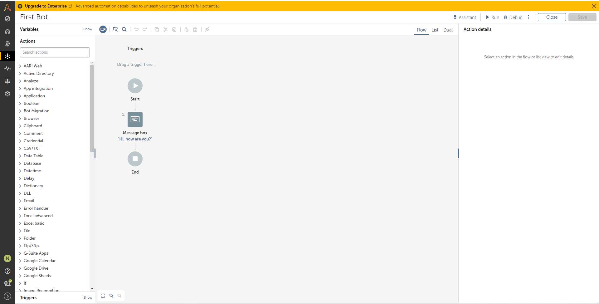
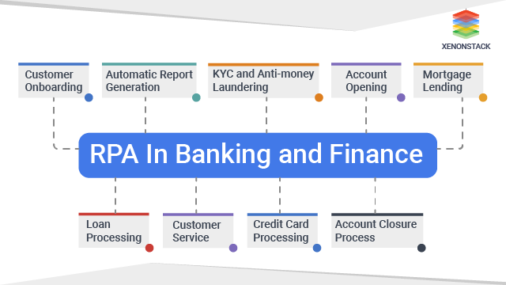

# RPA - Robotic Process Automation

## I. Types of RPA

---

- Supervised RPA = System + Human
- Unsupervised RPA = Only System
- Hybrid RPA = System + Optional Human

## II. ⚔️RPA vs AI

---

- RPA = hands / legs (take robot out of human)
- AI = Brain (put human into robot )

## III. ✨ Which factors should you consider while selecting a RPA Software?

You should consider the following factors before selecting a tool:

- Desired Platform Support: Web, Desktop, Citrix, SAP, etc
- License Cost if applicable
- In the case of an outsourcing project, you need to factor customer/Client preference of the automation tool
- The cost involved in training employees on the tool
- Hardware/Software requirements of the automation tool
- Support and Update policy of the automation tool vendor.

## III. 🏹Tools

---

1. **UiPath**

2. **[ZAPTEST](https://www.zaptest.com/media-pages/robotics-process-automation?utm_campaign=ZAPTEST%20FREE&utm_source=ppc&utm_medium=guru99&utm_content=landing%20page) - free**
   - **Goal**: who is looking to automate it’s back-office operations or software testing processes and to develop a seamless and revolving automation framework.
   - **Features**:
     - Functional and Performance Test Automation
     - RPA (Robotic Process Automation)
     - Seamless Test+RPA Software Automation
     - Cross-Platform (Parallel) Execution
     - DevOps (Mock-ups) Automation
     - API Testing
     - Auto-Documentation
   - **Companies currently use Zaptest**:
     | **Website** | **Employee Range** | **City** | **Region** | **Country** |
     |:---------------------: |:------------------: |:-------------: |:-----------: |:-------------: |
     | Olenick | 201-500 | Chicago | Illinois | United States |
     | QA Consultants | 201-500 | Toronto | Ontario | Canada |
     | Inflectra | 11-50 | Silver Spring | Maryland | United States |
     | ZAP TECHNOLOGIES, INC | 1-10 | Alpharetta | Georgia | United States |
     | Software Testing Help | 11-50 | Pune | Maharashtra | India |
     | ZAPTEST | 11-50 | Atlanta | Georgia | United States |
     | CodingSight | 1-10 | Mountain View | | Kenya |
     | Automated-360 | 1-10 | | | |
     | TestGuild | 1-10 | Oakdale | Tennessee | United States |
     | FiveTeams | 1-10 | Berlin | Berlin | Germany |
3. **[Eggplant](https://info.eggplantsoftware.com/robotic-process-automation-solutions?utm_campaign=FY21%20RPA%20Global%20Campaign&utm_source=ppc&utm_medium=Guru99&utm_term=rpa-lp-guru99) - free/Paid plans**
   - Features:
     - End-to-end automation able to interact with multiple systems to complete a task.
     - Universal fusion engine that can test any system from mobile to mainframe.
     - Resolve issues with real-time data analytics
     - Designed for process experts not technical experts or developers.
     - Reduce manual errors by automating repetitive process tasks.
4. **[HelpSystems](https://www.helpsystems.com/products/automate-plus?code=cmp-0000005625&ls=717710002&utm_source=guru99&utm_medium=contsynd&utm_campaign=am-miscellaneous&utm_content=late) - 30-day-free/Paid plans**

   - Features:
     - Over 600 prebuilt automation building blocks
     - Graphical workflow design brings IT and business teams together
     - Ability to integrate with an extensive list of applications
     - Intelligent automation capabilities with advanced conditions and trigger scenarios
     - Industry leading security, auditing, and integration capabilities
     - Centralized visibility, management, and reporting and analytics within distributed networks

5. **[JAMS](https://www.jamsscheduler.com/?code=cmp-0000009127&ls=717710002&utm_source=affiliate&utm_medium=contsynd&utm_campaign=jms-miscellaneous) - free/Paid plans**

   - Features:
     - Automate IT processes—from simple batch processes and scripts to complex cross-platform workflows
     - Centralize scheduling across all platforms, applications, APIs, and scripting languages
     - Leverage code-driven automation and apply business logic in jobs
     - Rely on event-based scheduling using triggers and user-defined events to increase automation control and efficiency

6. **[Kofax](https://www.kofax.com/products/rpa?cjevent=400843ea8a6e11ec82b100620a18050e&utm_source=cj) - free/Paid plans**

   - Features:
     - Helps you to remove errors by Automating Data Gathering and Input
     - Increase Operational Efficiency with Intelligent Software Robots
     - Monitor and Optimize Processes with Robotic Process Intelligence
     - Deploy, manage and execute robots from a centralized server
     - Built-In Analytics and Process Intelligence

7. **[Power Automate](<https://powerautomate.microsoft.com/en-us/?ranMID=24542&ranEAID=bt30QTxEyjA&ranSiteID=bt30QTxEyjA-QheU.1zmmuPYACv98EYuVQ&epi=bt30QTxEyjA-QheU.1zmmuPYACv98EYuVQ&irgwc=1&OCID=AID2200057_aff_7593_1243925&tduid=(ir__lo1ujt9mn0kf6ifuwywtsmimdn2xt2cqcwymr6yp00)(7593)(1243925)(bt30QTxEyjA-QheU.1zmmuPYACv98EYuVQ)()&irclickid=_lo1ujt9mn0kf6ifuwywtsmimdn2xt2cqcwymr6yp00>)**

8. **[Automation Anywhere](https://www.automationanywhere.com/)** - **30-day-free/Paid plans** for business; free community edition for students

   - **Goal**: RPA software for financial services, healthcare and insurance companies
   - ✔️:
     - cloud-native and web based AI platform (a Web-Based Management System which uses a Control Room to run the Automated Tasks)
     - create and maintain a digital workforce of software bots that complete end-to-end business processes
     - drag and drop features
     - has hands-on tutorials and webinars, as well as extensive modular training.
   - **Features:**
     - Intelligent automation for business and IT tasks
     - Uses SMART Automation Technology
     - Rapidly Automates complex and complicated tasks
     - Create automation tasks like recording keyboard strokes and mouse clicks
     - Distribute tasks to multiple computers
     - Automation Anywhere offers scriptless automation
     - Auto-login runs scheduled tasks on anytime, even when the computer is locked.
   - Can be **applicable to**:
     - **_Financial/Accounting:_** Invoice processing, reporting, auditing, etc.
     - **_Sales:_** Creating and printing invoices, add, modify and removing customer data into CRM.
     - **_Marketing:_** Creating lead generation reports and monitoring social sentiment.
     - **_Retail:_** Gather product details from manufacturer’s site, updating online inventory and importing website and email sales.
   - **Architecture:**
     

       
     

     1. **Control Room** - the Server that controls Automation Anywhere bots.
         

            
         

        - Responsibilities:
          - User management
          - Source control : code for the bots is managed by the control room. So it becomes easy to share the code across different systems.
          - Dashboard- It gives complete analytics/results of Automation Anywhere bots. You can see how many bots are runs and how bot failed/passed etc. is controlled.
          - License Management: The purchased licenses for Automation Anywhere are configured in the Control Room
          - Dev license: can create a bot, edit bot and run a bot.
          - Run license: run the bot and,will not make any changes.

     2. **Bot Creator:**
         

            
         

        **_is_Verified_**(dev_license) ? "Developers use Desktop based applications to create bots" : ""

     3. **Bot Runner**

        **_is_Verified_**(run_license) ? "bots can be running in parallel and report back the execution logs/pass/fail status back to the control room." : ""

   - **Types of bots:**
     1. _Task bot_: automation repetitive tasks based on rules.
     2. _Meta bot_: helps next-generation integration scalability.
     3. _IQ bot_: learns on it-self and carries on tasks in accordance with his learning.
   - **Companies currently use Automation Anywhere:**
     | **COMPANY NAME** | **WEBSITE** | **CITY** | **COUNTRY** | **TOP LEVEL INDUSTRY** | **SUB LEVEL INDUSTRY** |
     |:------------------: |:-----------------: |:--------: |:-----------: |:----------------------: |:----------------------: |
     | **Citi** | [citi.com](https://www.citi.com/) | New York | US | Finance | Banking |
     | **JPMorgan Chase** | [jpmorganchase.com](https://www.jpmorganchase.com/) | New York | US | Finance | Banking |
     | **UiPath** | [uipath.com](https://www.uipath.com/) | New York | US | Technical | Software Manufacturers |

## IV. 📠F-RPA

---

   

1. **KYC** (Know your client) documentation: professionals make an effort to verify the identity, suitability, and risks involved with maintaining a business relationship
   - Requires lots of data
   - Allow automate the manual process of filling KYC information
2. **Customer on-boarding**: the process - new users go through to get **set up** and **start using your product**, from **initial sign-up** to **product activation** and **first use**.
   - Requires a lot of manual verification documents
   - Teaching new users how to use your product
   - Goal: get users come back to the products
3. **Fraud detection:**
   - Combined with Machine Learning
   - Detect frauds and inform you before they occur
4. **Report Generation:**
   - Eliminates the menial task of generating reports of accounts and activities
   - Allows automatically read the reports and present them in a structured format.
5. **Account opening:**
   - Minimizes the errors that occur while opening an account with a bank or a financial company
   - Opens bank accounts of the customer without taking through a lengthy and manual process
6. **Loan processing & Mortgage Lending:**
   - Demands reliance on several processes from the beginning to the end of the workflow
   - Automatically verifies the records and disburses the amount of money.

---

### List other tools: _How it runs, how it fits our work ? --> report in detail how companies use them_

1. Cost - video demo, tut doc

2. Free - run sample
